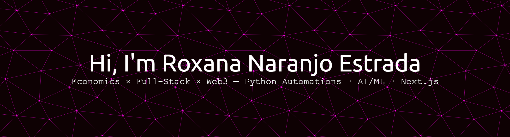

<!-- =====================  HERO  ===================== -->
 

  

  
  
  
  
  
   

<!-- GIF lateral discreto -->

<!-- =====================  ABOUT  ===================== -->
### About me
I’m an **Economics student (Universidad Nacional)** and a **full-stack builder**.  
I care about people **and** measurable outcomes. I love **Python automations** (APIs, scraping, schedulers, data pipelines) and I’m learning **AI/ML** (scikit-learn, basic **PyTorch**). I also explore **blockchain/Web3** to **democratize access** (payments, responsible micro-credit, supply-chain traceability, verifiable identity). I ship weekly **micro-MVPs**, document in public, and collaborate with the community.

- 🌱 Currently learning:
  - **Python automations** (orchestration, testing, logging, Docker)
  - **AI/ML**: scikit-learn (forecasting, recommenders, anomaly detection)
  - **PyTorch (basic)** for small vision/NLP experiments
  - **TypeScript + Next.js**
- 👯 Open to collaborate on **Open Source**, fintech/web3/data projects.
- ✔ Ask me anything — happy to help and share docs/tutorials.
- 📫 Reach out: <a href="mailto:rnaranjo@unal.edu.co">rnaranjo@unal.edu.co</a>

> **ES:** Estudio **Economía** y desarrollo **full-stack**. **Aprendiendo IA/ML y automatizaciones con Python**. Exploro **blockchain** para democratizar oportunidades. Lanzo **micro-MVPs** y documento en público.

---

<!-- =====================  SKILLS  ===================== -->
## Skills

  
<b>Languages & Frameworks</b>

  
    
    
    
    
    
    
  

  
<b>Data & ML</b>

  
    
    
    
    
    
  

  
<b>DevOps & Tools</b>

  
    
    
    
    
  

---

<!-- =====================  PROJECTS  ===================== -->
## Anchor projects
- **python-automations** — APIs/scraping/cron + Docker + CI → *saves hours/week*
- **ml-forecasting-starter** — scikit-learn baseline + **FastAPI** `/predict` + demo
- **portfolio-nextjs** — TS/Next.js landing (Projects, Articles, Contact)

---

<!-- =====================  STATS  ===================== -->
<h2 align="center">GitHub stats</h2>

  
  

  

  

  
📈 Activity graph 

